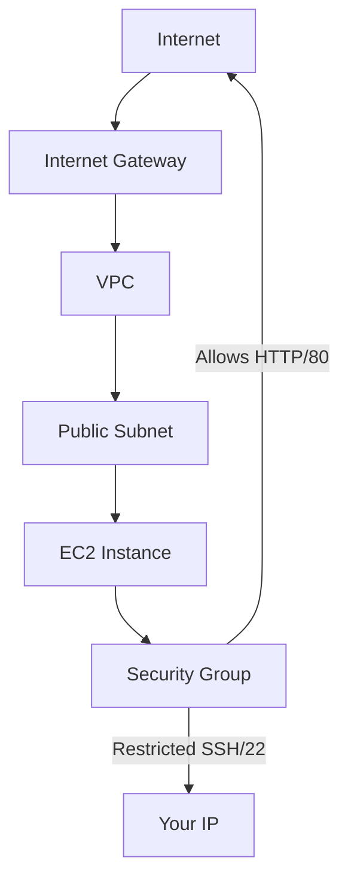

# Flask Application Deployment on AWS using Terraform

[](https://www.terraform.io/)
[](https://registry.terraform.io/providers/hashicorp/aws/latest)


A Terraform project to deploy a Flask application on AWS infrastructure with proper networking and security configurations.

## Features

- 🚀 **Automatic Deployment**: Full infrastructure-as-code setup
- 🔒 **Security**: Configured security groups with restricted SSH access
- 🌐 **Networking**: Includes VPC, subnet, internet gateway, and route tables
- 📦 **Provisioning**: Automatic dependency installation and application startup
- 📡 **Public Access**: Flask application accessible via public IP
- 💻 **SSH Access**: Pre-configured key-based authentication

## Prerequisites

- [Terraform](https://www.terraform.io/downloads.html) (>=1.3.0)
- [AWS CLI](https://aws.amazon.com/cli/) configured with credentials
- SSH key pair in `~/.ssh/` directory
- AWS account with necessary permissions

## Quick Start

### 1. Clone Repository
```bash
git clone https://github.com/your-username/flask-terraform-deployment.git
cd flask-terraform-deployment
```

### 2. Configure AWS Credentials

```bash   Copy
aws configure
```
### 3. Modify Variables (Optional)
### Edit variables.tf to customize:

```terraform   Copy
variable "region" {
  default = "ap-south-1" # Change AWS region
}

variable "ssh_ip" {
  default = "YOUR_IP/32" # Restrict SSH access
}
```

### 4. Initialize Terraform

```bash   Copy
terraform init
```

### 5. Deploy Infrastructure

```bash  Copy
terraform apply
```

## Architecture Diagram



## Project Structure

```Copy
.
├── main.tf          # Primary infrastructure configuration
├── variables.tf     # Input variables
├── outputs.tf       # Output values
├── app.py           # Flask application
├── README.md        # Documentation
└── .gitignore       # Ignore Terraform files
```

## Customization
### Variables

--------------------------------------------------
Variable     |	Description	      | Default Value
-------------|-------------------|----------------
region	    | AWS region	      | ap-south-1
cidr	       | VPC CIDR block	   | 10.0.0.0/16
instance_type|	EC2 instance type	| t2.micro
ssh_ip	    | Allowed SSH IP	   | 0.0.0.0/0

### Application

1. Modify ```app.py``` to change Flask application behavior

2. Commit changes and re-run ```terraform apply```

## Accessing the Application
### After deployment:

```bash    Copy
curl $(terraform output -raw flask_app_url)
```

## Best Practices
### 1. Security:

* Always restrict SSH access to your IP

* Rotate SSH keys regularly

* Use IAM roles instead of access keys

2. Cost Management:

* Use t2.micro instances for free tier

* Destroy infrastructure when not in use

```bash  Copy
terraform destroy
```

3. Monitoring:

* Enable CloudWatch monitoring

* Set up billing alerts

## Troubleshooting

Common Issues

------------------------------------------------------------------------------
Error	                        |    Solution
------------------------------------------------------------------------------
```SSH Connection Refused```  |	Verify security group rules and key pair
------------------------------------------------------------------------------
```Port 80 Not Accessible```	| Check authbind configuration in provisioner
------------------------------------------------------------------------------
```AMI Not Found```	          | Update AMI filter in data "aws_ami" block
------------------------------------------------------------------------------
```Terraform Plan Errors```   | Run terraform validate to check configuration

### View Logs

```bash   Copy
ssh -i ~/.ssh/id_ed25519 ubuntu@$(terraform output -raw instance_public_ip) "tail -f /home/ubuntu/flask.log"
```